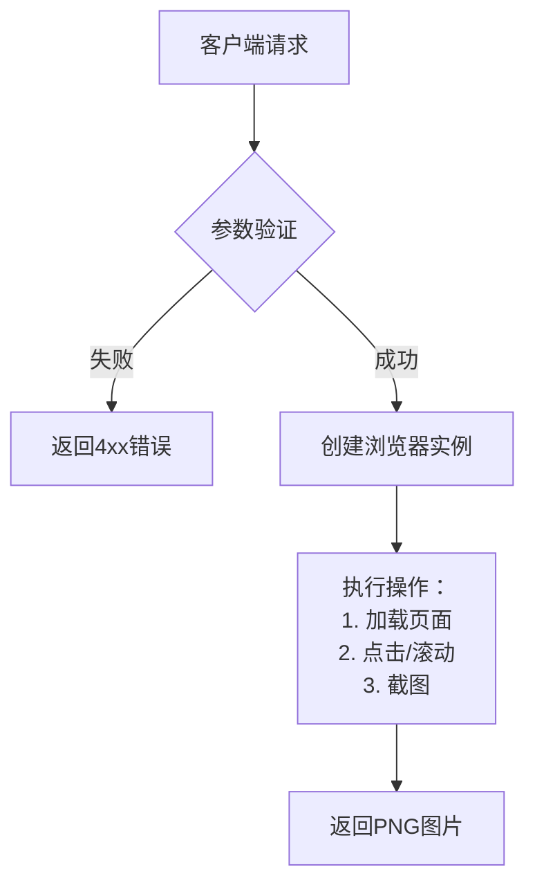

# 📸Pcap

这是一个基于 FastAPI 和 Playwright 的网页截图 API，支持高并发访问并优化了性能。

---

## 功能特性
- ✅ 支持跨域访问
- ⚡️ 高性能，支持高并发
- 🔒 自动验证 URL 合法性
- 📸 返回 PNG 格式的截图
- 🖱️ 支持元素点击后截图
- 🖼️ 支持页面滚动后截图

---

## 安装部署

### 1. 安装 Python 依赖
```bash
# 创建虚拟环境（推荐）
python3 -m venv venv
source venv/bin/activate

# 安装依赖包
pip install fastapi uvicorn playwright
```

### 2. 安装浏览器内核
```bash
playwright install chromium
```

---

## API 接口文档

### 基础截图接口
```http
GET /screenshot?url={encoded_url}
```
**参数说明**
| 参数 | 类型   | 必需 | 说明                   |
|------|--------|------|------------------------|
| url  | string | 是   | 需要截图的网页完整URL  |

**示例**
```bash
curl "http://localhost:8000/screenshot?url=https%3A%2F%2Fexample.com" -o output.png
```

---

### 点击元素后截图
```http
GET /screenshot_after_click?url={encoded_url}&text={element_text}
```
**参数说明**
| 参数 | 类型   | 必需 | 说明                       |
|------|--------|------|----------------------------|
| url  | string | 是   | 目标网页URL                |
| text | string | 是   | 需要点击的页面元素文本内容 |

**示例**
```bash
curl "http://localhost:8000/screenshot_after_click?url=https%3A%2F%2Fexample.com&text=Sign%20In" -o clicked.png
```

---

### 滚动页面后截图
```http
GET /screenshot_after_scroll?url={encoded_url}&delta_y={pixels}
```
**参数说明**
| 参数    | 类型 | 必需 | 说明                       |
|---------|------|------|----------------------------|
| url     | string | 是 | 目标网页URL                |
| delta_y | int    | 是 | 垂直滚动像素值（正=向下）  |

**示例**
```bash
curl "http://localhost:8000/screenshot_after_scroll?url=https%3A%2F%2Fexample.com&delta_y=800" -o scrolled.png
```

---

## 技术细节

### 请求流程


### 错误代码表
| 状态码 | 说明                        |
|--------|-----------------------------|
| 400    | 无效的URL格式               |
| 404    | 未找到指定文本元素          |
| 408    | 页面加载超时                |
| 500    | 服务器内部错误              |

---

## 高级配置

### 性能调优参数
```python
# main.py 中的关键配置
_semaphore = asyncio.Semaphore(10)  # 并发控制
VIEWPORT = {"width": 1280, "height": 800}  # 视口尺寸
TIMEOUT = 15000  # 页面加载超时（毫秒）
```

### 生产环境部署
```bash
# 使用4个worker进程 + gzip压缩
uvicorn main:app --workers 4 \
    --proxy-headers \
    --host 0.0.0.0 \
    --port 8000 \
    --timeout-keep-alive 30
```

---

## 最佳实践

### 安全建议
1. 在 `validate_url` 函数中添加域名白名单：
```python
ALLOWED_DOMAINS = {"example.com", "trusted-site.org"}

def validate_url(url: str) -> bool:
    parsed = urlparse(url)
    return parsed.netloc in ALLOWED_DOMAINS
```

### 性能优化
- 多次滚动截取长页面：
```bash
# 分段截取长页面
for y in 0 1000 2000 3000; do
  curl "http://localhost:8000/screenshot_after_scroll?url=...&delta_y=$y" -o "part_$y.png"
done
```

---
> 📌 注意：所有URL参数需要经过URL编码处理，建议使用`urllib.parse.quote`进行编码

## 未来工作
### 这是我们的开源周的第一个产品，支持网页操作！
*   实现更多操作
*   展示鼠标和浏览器外壳等....
